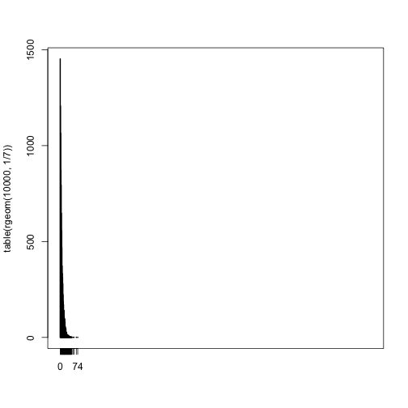

```r
set.seed(1) # set random number seed for reproducibility
```

## Parameter estimation

According to Harte et al. (2008), the distribution of abundance values, $n$, across plots of size $A$ follows a probability distribution that declines exponentially (assuming $A$ is less than half the total study area, which is the only case we typically care about). In statistical terminology, that means we want the geometric distribution, which describes the distribution of the number of failures in a sequence of Bernoulli trials before the first success occurs.  This distribution has a parameter, $p$ describing the probability of success in these trials.  Figure 1 shows two examples of probability distribution functions from this family, with $p=.8$  (in black) and $p=.5$ (in red).


```r
plot(0:10, dgeom(0:10, p = .8), type = "h", lwd = 3, xlab = "n", ylab = "frequency")
points(0:10 + .1, dgeom(0:10, p = .5), type = "h", lwd = 3, col = "red")
```

 

Let's say we observe a site with $n=7$.  That outcome could have been generated from a range of possible geometric distributions, and we can assign a likelihood ($\mathrm{prob}(n|p)$) to them.


```r
curve(dgeom(7, x), from = .0001, xlab = "p", ylab = "likelihood")
```

 

I'm pretty sure the likelihood is proportional to a beta distribution (because conjugate priors). Trial and error indicates that it has $\mathrm{shape1} = 2$ and $\mathrm{shape2} = n + 1$. Interestingly, this distribution's mean is *not* just $1/n$, which is what one might have expected (it's somewhat closer to $0.5$, especially when $n$ is small).


```r
Z = exp(4.276666) # Proportionality constant, found empirically

curve(dgeom(7, x), from = .0001, xlab = "p", ylab = "likelihood", lwd = 4)
curve(dbeta(x, shape1 = 2, shape2 = 7 + 1) / Z, add = TRUE, col = "red", lwd = 2)
```

 

If we'd observed $n$ at more than one site, then our estimate of $p$ would still follow a beta distribution, it would just have larger shape parameters (and less uncertainty). I think we'd just keep adding $n$'s and possibly $1$'s to the shape parameters, but I haven't played around with it yet to be sure.

## Predicting one new site

This beta distribution describes our uncertainty about the "true" value of the parameter $p$.

If the parameter $p$ can take on different values from this distribution, then a wide range of outcomes are possible the next time we collect a sample from an area of size $A$.


```r
p_parameter_possibilities = rbeta(10000, 2, 7 + 2)
sample_n_values = rgeom(10000, p_parameter_possibilities)
plot(table(sample_n_values))
```

 

This distribution has a much longer tail than what we'd have gotten if we had assumed we knew $p$ exactly. If we had just assumed $p = 1/n$, we'd have expected a distribution like this:


```r
plot(table(rgeom(10000, 1/21)), xlim = range(sample_n_values))
```

 

## Scaling up

Now let's scale up to multiple sites (e.g. 1000).  The METE model assumes that there's a single landscape-wide value of $p$, we just don't know what it is.  So for each possible value of $p$, we could sample 1000 sites of size $A$ and add up the $n$ values to get $n_0$.

I'm pretty sure that the resulting distribution is some kind of negative binomial, and it might even be Poisson.


```r
n_0_possibilities = sapply(
  rbeta(1000, 2, 7 + 2),
  function(p){
    sum(rgeom(1000, p))
  }
)

plot(density(n_0_possibilities))
```

 

## Scaling up with spatial heterogeneity

If there's spatial heterogeneity, then we won't have the same $p$ at all sites. We'd thus expect an even broader range of possibilities when we scaled up than above.  Depending on what kind of distribution we expect for $p$ across sites, we could do this in different ways. The most principled approach would be to fit a mixture of geometric distributions in the first step, instead of just one, and then carry the results through the rest of the process.  Alternatively, we might be able to just increase the overdispersion of our negative binomial (i.e. wait until the last step to worry about it).
